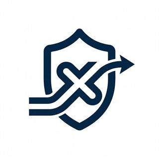

<div align="center">



# فیلترگشا · FilterGosha

**پنل مدیریت اشتراک و کانفیگ، با تمرکز روی پایداری در شبکه‌ی ایران**

فورک‌شده از پروژه‌ی [X4G](https://www.youtube.com/@X4GHUB)

[](#-تاریخ-نسخهها)
[](https://t.me/FilterGosha)
[](#)

<br/>

**[🇮🇷 راهنمای فارسی (پیش‌فرض)](#فهرست)** • **[🇬🇧 English Documentation](#-filtergosha--english-overview)**

</div>

> ### 💖 حمایت از پروژه
> این پروژه رایگان و متن‌باز است. اگر برایتان مفید بود، با یک ⭐ یا حمایت مالی به ادامه‌ی توسعه‌اش کمک کنید:
>
> | شبکه | آدرس کیف پول |
> | :--- | :--- |
> | **USDT · BEP20** | `0xd593ae9D32bEA690EC62460C54BF3951aFFF7803` |
> | **USDT · TRC20** | `THaaHzoTwXfUfcrtYTDXRsMmk9qhnXa56M` |

---

## فهرست

- [این پنل چه کاری برای شما می‌کند؟](#-این-پنل-چه-کاری-برای-شما-میکند)
- [شروع به کار](#-شروع-به-کار)
- [ورود به پنل](#-ورود-به-پنل)
- [کارهای روزمره](#-کارهای-روزمره)
- [تنظیمات](#-تنظیمات)
- [پرسش‌های پرتکرار](#-پرسشهای-پرتکرار)
- [تاریخ نسخه‌ها](#-تاریخ-نسخهها)
- [پشتیبانی](#-پشتیبانی)
- [English Overview](#-filtergosha--english-overview)

---

## ✨ این پنل چه کاری برای شما می‌کند؟

<table>
<tr><td width="34%">

**🧩 پنج نوع کانفیگ**

</td><td>

WebSocket، gRPC، XHTTP، Trojan و SOCKS5 — هر کدام را با پورت، SNI، فینگرپرینت و ALPN دلخواه بسازید.

</td></tr>
<tr><td>

**🛡️ ابزارهای ضدفیلتر**

</td><td>

Fragment، آی‌پی تمیز، فینگرپرینت مرورگر و اسکریپت آماده‌ی Cloudflare Worker / Pages برای عبور از اختلال اپراتورها.

</td></tr>
<tr><td>

**👥 اشتراک چندکانفیگی**

</td><td>

هر اشتراک می‌تواند چند کانفیگ داشته باشد و هر کانفیگ بین چند اشتراک مشترک باشد.

</td></tr>
<tr><td>

**📊 محدودیت‌های دقیق**

</td><td>

سقف حجم، تاریخ انقضا با تقویم شمسی، محدودیت تعداد آی‌پی همزمان، محدودیت دستگاه (HWID) و محدودیت سرعت — روی اشتراک یا روی تک‌کانفیگ.

</td></tr>
<tr><td>

**📡 آمار زنده**

</td><td>

تعداد کاربران واقعی متصل، مصرف لحظه‌ای، نمودار ترافیک، لاگ فعالیت‌ها و فهرست خطاها.

</td></tr>
<tr><td>

**🔗 صفحه‌ی اشتراک کاربر**

</td><td>

یک لینک برای کاربر: هم در کلاینت‌ها به‌عنوان ساب کار می‌کند، هم در مرورگر صفحه‌ی فارسی حجم/انقضا/QR را نشان می‌دهد.

</td></tr>
<tr><td>

**⚙️ مدیریت گروهی**

</td><td>

انتخاب چندتایی اشتراک‌ها و کانفیگ‌ها و حذف گروهی آن‌ها، ریست مصرف و تغییر ریمارک با چند کلیک.

</td></tr>
<tr><td>

**💾 بک‌آپ گزینشی**

</td><td>

انتخاب کنید چه چیزی بک‌آپ گرفته شود (کانفیگ‌ها، اشتراک‌ها، تنظیمات، رمز، آمار مصرف) و فایل را در هر پنل دیگری بازیابی کنید.

</td></tr>
</table>

---

## 🚀 شروع به کار

<details open>
<summary><b>گزینه ۱ — Railway (ساده‌ترین راه)</b></summary>

1. این مخزن را **Fork** کنید.
2. در [Railway.app](https://railway.app) مسیر **New Project → Deploy from GitHub repo** را برید و مخزن خود را انتخاب کنید.
3. از تب **Volumes** یک والیوم روی مسیر `/data` بسازید. ← این مرحله را رد نکنید، وگرنه با هر دیپلوی داده‌ها پاک می‌شوند.
4. از تب **Networking** یک Public Domain بگیرید.
5. آدرس `https://your-domain.up.railway.app/login` را باز کنید.

</details>

<details>
<summary><b>گزینه ۲ — داکر</b></summary>

```bash
docker build -t filtergosha .

docker run -d --name filtergosha \
  -p 9890:9890 -p 1080:1080 \
  -v $(pwd)/data:/data \
  -e ADMIN_PASSWORD="YourStrongPassword" \
  --restart unless-stopped \
  filtergosha
```

</details>

<details>
<summary><b>گزینه ۳ — اجرای مستقیم</b></summary>

```bash
pip install -r requirements.txt
python -m uvicorn main:app --host 0.0.0.0 --port 9890
```

</details>

---

## 🔑 ورود به پنل

| | |
| :--- | :--- |
| آدرس پنل | `https://your-domain.com/login` |
| رمز پیش‌فرض | `FilterGosha` |

**اولین کاری که باید بکنید:** از مسیر «تنظیمات → تغییر رمز عبور» رمز پیش‌فرض را عوض کنید.

---

## 📘 کارهای روزمره

### ساخت کانفیگ

از منوی **کانفیگ‌ها → کانفیگ جدید**، نوع کانفیگ را انتخاب کنید:

| نوع | مناسب برای |
| :--- | :--- |
| **WebSocket** | عبور از Cloudflare Worker؛ سازگارترین گزینه با اکثر کلاینت‌ها |
| **gRPC** | پینگ پایین و اتصال پایدار روی HTTP/2 |
| **XHTTP** | مقاوم‌ترین حالت در زمان اختلال شدید شبکه |
| **Trojan** | ارتباط امن و پایدار، سوار بر بستر WebSocket |
| **SOCKS5** | تلگرام، کنسول بازی، ویندوز و نرم‌افزارهایی که ساب نمی‌خوانند |
| **کاستوم** | افزودن لینک یا پروکسی آماده‌ی سرویس‌های دیگر به اشتراک‌ها |

### ساخت اشتراک برای کاربر

1. **اشتراک‌ها → اشتراک جدید** را بزنید.
2. نام، حجم، مدت اعتبار، سقف آی‌پی همزمان، محدودیت دستگاه (HWID) و سقف سرعت را وارد کنید.
3. کانفیگ‌هایی که باید داخل این اشتراک باشند را تیک بزنید.
4. لینک ساب را کپی و برای کاربر ارسال کنید.

کاربر همان یک لینک را:
- در **v2rayNG / Hiddify / Sing-Box / NekoBox / Shadowrocket** به‌عنوان Subscription اضافه می‌کند،
- یا در **مرورگر** باز می‌کند و حجم باقی‌مانده، تاریخ انقضا، نام‌کاربری SOCKS5 و QR هر کانفیگ را می‌بیند.

### بک‌آپ و انتقال

از **تنظیمات → بک‌آپ و بازیابی**، تیک بخش‌های موردنظر را بزنید و فایل `.db` را دانلود کنید. همان فایل را می‌توانید در پنل دیگری آپلود کنید؛ پنل قبل از بازیابی محتوای فایل و موارد تکراری را نشان می‌دهد و می‌پرسد که جایگزین شوند یا رد شوند.

---

## ⚙️ تنظیمات

متغیرهای محیطی (همه اختیاری، جز رمز که بهتر است تنظیم شود):

| متغیر | کاربرد | پیش‌فرض |
| :--- | :--- | :--- |
| `ADMIN_PASSWORD` | رمز ورود به پنل | `FilterGosha` |
| `DATA_DIR` | محل نگه‌داری داده‌ها | `/data` |
| `WORKER_DOMAIN` | دامنه‌ی Cloudflare Worker | خالی |
| `CLEAN_IP` | آی‌پی تمیز پیش‌فرض کانفیگ‌ها | خالی |
| `REMARK_PREFIX` | پیشوند نام کانفیگ‌ها در کلاینت | `FilterGosha` |

همین موارد از داخل صفحه‌ی **تنظیمات** پنل هم قابل تغییرند و نیازی به ری‌استارت ندارند.

---

## ❓ پرسش‌های پرتکرار

<details>
<summary>رمز پنل را فراموش کردم.</summary>

متغیر محیطی `ADMIN_PASSWORD` را روی مقدار جدید بگذارید و سرویس را ری‌استارت کنید.

</details>

<details>
<summary>بعد از دیپلوی جدید، کانفیگ‌ها پاک شدند.</summary>

والیوم روی مسیر `/data` وصل نیست. آن را بسازید و آخرین فایل بک‌آپ را از صفحه‌ی تنظیمات بازیابی کنید.

</details>

<details>
<summary>عدد «اتصالات فعال» با تعداد کاربرانم نمی‌خواند.</summary>

از نسخه‌ی 1.4.10 این عدد تعداد **کاربران واقعی** است، نه تعداد استریم‌های باز. اگر عدد بزرگی می‌بینید، پنل را به آخرین نسخه برسانید.

</details>

<details>
<summary>کاربر می‌گوید ساب باز نمی‌شود.</summary>

یک بار لینک ساب را در مرورگر خودتان باز کنید؛ اگر صفحه بالا آمد مشکل از سمت کلاینت کاربر است. اگر بالا نیامد، وضعیت اشتراک (فعال بودن، انقضا و باقی‌مانده‌ی حجم) را بررسی کنید.

</details>

<details>
<summary>کانفیگ در ایرانسل/رایتل قطع می‌شود.</summary>

اسکریپت Cloudflare Worker یا Pages را از صفحه‌ی تنظیمات کپی و دیپلوی کنید، دامنه‌ی آن را در همان صفحه ثبت کنید و یک کانفیگ WebSocket بسازید. در صورت نیاز Fragment را روی کانفیگ فعال کنید.

</details>

---

## 📜 تاریخ نسخه‌ها

### `1.8.18` — نسخه‌ی فعلی
- **سیستم محدودیت دستگاه (HWID):** امکان محدود کردن تعداد دستگاه‌های متصل به اشتراک اضافه شد. با اتصال اولین دستگاه‌ها، اشتراک روی آن‌ها قفل (bind) می‌شود و دستگاه‌های اضافی رد می‌شوند.
  - *نکته فنی و محدودیت صادقانه:* پروتکل‌های VLESS/Trojan/SOCKS5 شناسه‌ی سخت‌افزاری واقعی از دستگاه نمی‌فرستند. سیستم ما از هدر صریح `X-HWID` (در صورت ارسال توسط کلاینت‌های سفارشی) یا هشِ `User-Agent` کلاینت (روی ترابرد‌های HTTP) برای تشخیص دستگاه استفاده می‌کند. چون `User-Agent` در دو دستگاه با سیستم‌عامل و کلاینت یکسان ممکن است مشابه باشد، این روش یک تخمین و روشی «تقریبی» است، نه HWID سخت‌افزاری قطعی. 
  - کانفیگ‌های SOCKS5 خام به دلیل نداشتن هدر از این سیستم معاف هستند (در آنجا محدودیت آی‌پی کار می‌کند).
- **افزودن پروتکل Trojan روی WebSocket:** پشتیبانی از Trojan روی بستر WebSocket اضافه شد که کاملاً سازگار با معماری پنل است (پنل هرگز سوکت TLS خام نمی‌سازد، بلکه سوار بر WebSocket است). این کانفیگ با محدودیت‌های حجم، آی‌پی و سرعت پنل یکپارچه است.
- **تغییر رمز عبور پیش‌فرض:** رمز پیش‌فرض اکانت به `FilterGosha` تغییر یافت.

### `1.4.13`
- بک‌آپ گزینشی: با چک‌لیست انتخاب کنید کانفیگ‌ها، اشتراک‌ها، تنظیمات، رمز عبور و آمار مصرف کدام‌ها داخل فایل بک‌آپ بروند.
- فایل بک‌آپ فقط شامل موارد انتخاب‌شده است و در پنل‌های دیگر بدون خطا بازیابی می‌شود.
- پیش از بازیابی، محتوای فایل و تعداد موارد تکراری نمایش داده می‌شود و برای بازنویسی رمز عبور جداگانه تأیید گرفته می‌شود.

### `1.4.11`
- دکمه‌ی «صفحه گیت‌هاب پروژه» با نور و رنگ متحرک در طیف سفید.
- نام فایل‌های داده به `filterGosha` تغییر کرد؛ نصب‌های قبلی به‌صورت خودکار و بدون از دست رفتن داده منتقل می‌شوند.

### `1.4.10`
- رفع اشکال شمارش «اتصالات فعال» که عددهای غیرواقعی (مثلاً ۷۲ اتصال برای یک کاربر) نشان می‌داد.
- عدد کاربران متصل در داشبورد، صفحه‌ی اشتراک کاربر و ردیف تک‌تک کانفیگ‌ها یکسان و درست شد.
- شمارش برای کاربرانی که با آی‌پی تمیز یا Cloudflare Worker وصل می‌شوند هم اصلاح شد.

### `1.4.6`
- انتخاب چندتایی و حذف گروهی اشتراک‌ها و کانفیگ‌ها.
- نمایش هشدار پیش از حذف و گزارش تعداد موارد حذف‌شده.

### `1.4.3`
- ثبت تاریخ انقضا با تقویم شمسی و انتخابگر تاریخ در فرم اشتراک و کانفیگ.
- نگه‌داری دائمی آمار مصرف و افزودن دکمه‌ی ریست مصرف.

### `1.4.0`
- ذخیره‌سازی دائمی داده‌ها با پایداری بیشتر و بدون قطعی هنگام ری‌استارت.
- رفع اشکال ناپدید شدن کانفیگ حذف‌شده از اشتراک‌های مرتبط.

### `1.3.3`
- سرور SOCKS5 مستقل با نام‌کاربری کوتاه ۶ کاراکتری.
- نمایش نام‌کاربری SOCKS5 در صفحه‌ی اشتراک کاربر و ساده‌سازی فرم ساخت این نوع کانفیگ.

### `1.3.0`
- معماری چند-به-چند: چند کانفیگ در یک اشتراک و اشتراک‌گذاری یک کانفیگ بین چند اشتراک.
- افزودن دانلود بک‌آپ و بازیابی آن با بررسی موارد تکراری.

### `1.2.4`
- افزودن XHTTP، فینگرپرینت مرورگر (Chrome/Firefox/Safari/iOS/Android/Edge) و انتخاب ALPN.

### `1.2.0`
- Fragment ضد DPI، محدودیت تعداد آی‌پی همزمان و محدودیت سرعت برای هر کاربر.

### `1.0.0`
- انتشار اولیه: VLESS روی WebSocket و gRPC، داشبورد فارسی با آمار زنده و لینک ساب دومنظوره (کلاینت + مرورگر).

---

## 📢 پشتیبانی

- کانال تلگرام: [@FilterGosha](https://t.me/FilterGosha)
- گزارش باگ و درخواست قابلیت: [GitHub Issues](https://github.com/thekourox/FilterGosha/issues)

---

<br/>
<br/>

<div align="center" id="-filtergosha--english-overview">


# FilterGosha

**Minimalist Proxy & Subscription Management Panel**

*Forked from [X4G](https://www.youtube.com/@X4GHUB)*

[](#)
[](https://t.me/FilterGosha)
[](#)

<br/>

</div>

> # 📢 English Version Coming Soon!
> # 🚀 Full English language support will be officially added in **Version 2.0**!
> **Stay tuned for comprehensive internationalization, English UI options, and complete English guides in the next major milestone.**

---

## 🌐 English Overview

**FilterGosha** is a lightweight, resilient proxy and subscription management panel tailored for personal VPN servers and small-scale subscription distribution under strict network censorship conditions. Built on Python and FastAPI, it eliminates bloated dependencies while delivering robust circumvention mechanisms.

### ✨ Key Features:
- **Multi-Protocol Relays:** Supports WebSocket, gRPC, XHTTP, Trojan (over WebSocket), and standalone SOCKS5 proxy servers.
- **Anti-Censorship Toolkit:** Built-in TLS Fragmenting, Clean IP routing, browser TLS fingerprinting emulation (Chrome/Firefox/iOS/Safari/Edge), and ready-to-deploy Cloudflare Worker/Pages scripts.
- **HWID & Device Binding:** Lock subscriptions to the first $N$ connected devices via header heuristics (`X-HWID` or `User-Agent` fingerprinting) to prevent unauthorized credential sharing.
- **Dual-Purpose Subscription Links:** A single universal subscription URL that imports seamlessly into clients (*v2rayNG, Hiddify, Sing-Box, NekoBox, Shadowrocket*) or opens directly in web browsers as an interactive user dashboard with remaining data, expiration timers, and QR codes.
- **Granular Quota & Schedule Management:** Set bandwidth quotas, Jalali (Solar Hijri) and Gregorian expiration dates, concurrent IP limits, and bandwidth speed throttles.
- **Selective Backup & Restore:** Selectively package and migrate configs, subscriptions, settings, credentials, and usage statistics with duplicate detection.

### 🚀 Quick Start

<details open>
<summary><b>Option 1: Railway (Easiest Way)</b></summary>

1. **Fork** this repository.
2. In [Railway.app](https://railway.app), choose **New Project → Deploy from GitHub repo** and select your fork.
3. Attach a persistent volume to `/data` in the **Volumes** tab (required to keep data across redeploys).
4. Generate a Public Domain from the **Networking** tab.
5. Visit `https://your-domain.up.railway.app/login`.

</details>

<details>
<summary><b>Option 2: Docker</b></summary>

```bash
docker build -t filtergosha .

docker run -d --name filtergosha \
  -p 9890:9890 -p 1080:1080 \
  -v $(pwd)/data:/data \
  -e ADMIN_PASSWORD="YourStrongPassword" \
  --restart unless-stopped \
  filtergosha
```

</details>

<details>
<summary><b>Option 3: Direct Run</b></summary>

```bash
pip install -r requirements.txt
python -m uvicorn main:app --host 0.0.0.0 --port 9890
```

</details>

---

### 🔑 Login Credentials

| | |
| :--- | :--- |
| **Panel URL** | `https://your-domain.com/login` |
| **Default Password** | `FilterGosha` |

*Recommendation: Change your default password immediately under Settings → Change Password.*

---

## 📢 Community & Support

- **Telegram Channel:** [@FilterGosha](https://t.me/FilterGosha)
- **Bug Reports & Feature Requests:** [GitHub Issues](https://github.com/amirmarandidev/FilterGosha/issues)

<div align="center">

If you find this project helpful, please consider giving it a ⭐ on GitHub!

</div>
